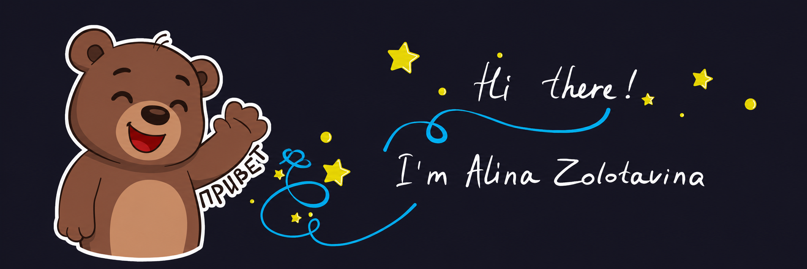

## About Me

## About Me

Hi, I'm Alina, a React and Full-Stack JavaScript Developer passionate about building modern, user-friendly web applications.

Over the past few years, I have independently designed, developed, deployed, and maintained production web applications using React, TypeScript, Node.js, Express, and MongoDB. While my main interest is frontend development and creating great user experiences, I also enjoy working on backend APIs, deployment, testing, and CI/CD.

I like improving code quality through refactoring, writing maintainable code, and continuously learning new technologies.

Currently open to Frontend Developer, React Developer, and Full-Stack JavaScript Developer opportunities.

Email: [albekmerus@gmail.com](mailto:albekmerus@gmail.com)

Resume: [English resume](https://drive.google.com/file/d/1kV4ToweZH7tR0xR1whYc4IaNcwIUNcAI/view?usp=sharing)

Website: https://znac.org/alina/about

## Tech Stack

Frontend:

Backend and Database:

Testing and Quality:

Deployment and Tooling:

Design:

## Featured Projects

### ZNAC

Full-stack content platform built with React, Node.js, Express, and MongoDB.

Highlights:

- Public website, blog, projects showcase, photo gallery, and admin flows.
- React frontend with a custom Express API and MongoDB.
- Automated tests for frontend and backend.
- CI/CD with GitHub Actions, Docker, Nginx, GHCR, and AWS Lightsail.

Links:

- Live: https://znac.org
- Frontend: https://github.com/AlinaZolotavina/znac
- Backend API: https://github.com/AlinaZolotavina/znac-api
- Infrastructure: https://github.com/AlinaZolotavina/znac-project

### Find Pair

Memory game built with React, TypeScript, and Jest.

- Demo: https://alinazolotavina.github.io/find-pair/
- Source: https://github.com/AlinaZolotavina/find-pair

### Tic-Tac-Toe

Tic-Tac-Toe game built with React, TypeScript, and Jest.

- Demo: https://alinazolotavina.github.io/tic-tac-toe/
- Source: https://github.com/AlinaZolotavina/tic-tac-toe

## Current Focus

- Improving ZNAC production deployment and observability.
- Expanding frontend and backend test coverage.
- Strengthening React architecture and reusable feature structure.
- Migrating selected parts of the project toward TypeScript.
- Improving accessibility, performance, and responsive behavior.

## Contacts

