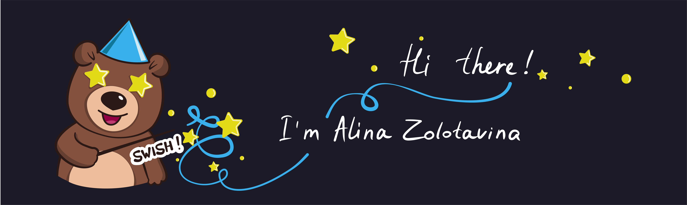

## About me 

- 🐣 I'm newbie in frontend development and really wanna develop great software solutions.
- 📚 I have started and keep learning Java Script and React JS, wanna know more about component architecture of web applications. 
- 🎨 In my free time I create vector graphic in AI and do print design as hobbie. 
- 📫 You can reach me anytime by email.
- 📄 You can find more information about me in my resume in [English](https://drive.google.com/file/d/1V21K37qzL2CAJxjtmJuRfFuBRNBNRXTD/view?usp=sharing) and [Russian](https://drive.google.com/file/d/1qlIIo5WL7E2x7ZlNBI7UEESGlWBzehKy/view?usp=sharing) as well.

## Tech Stack
                

## My Github statistics

 

## Contacts
    
 
